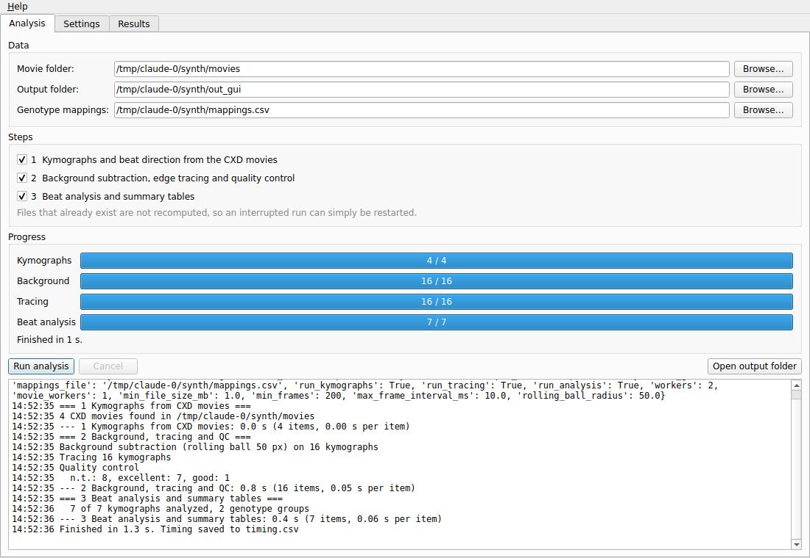
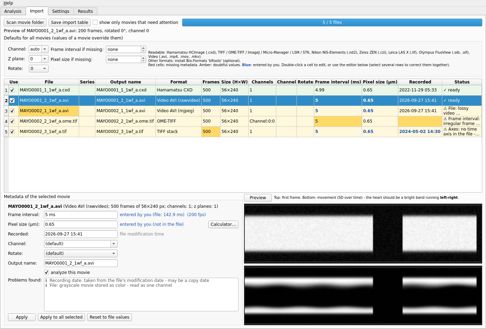
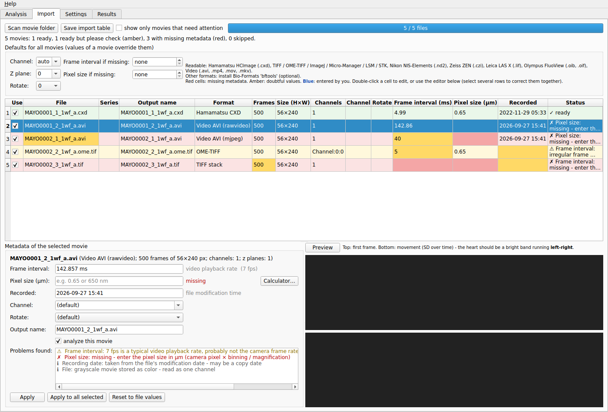
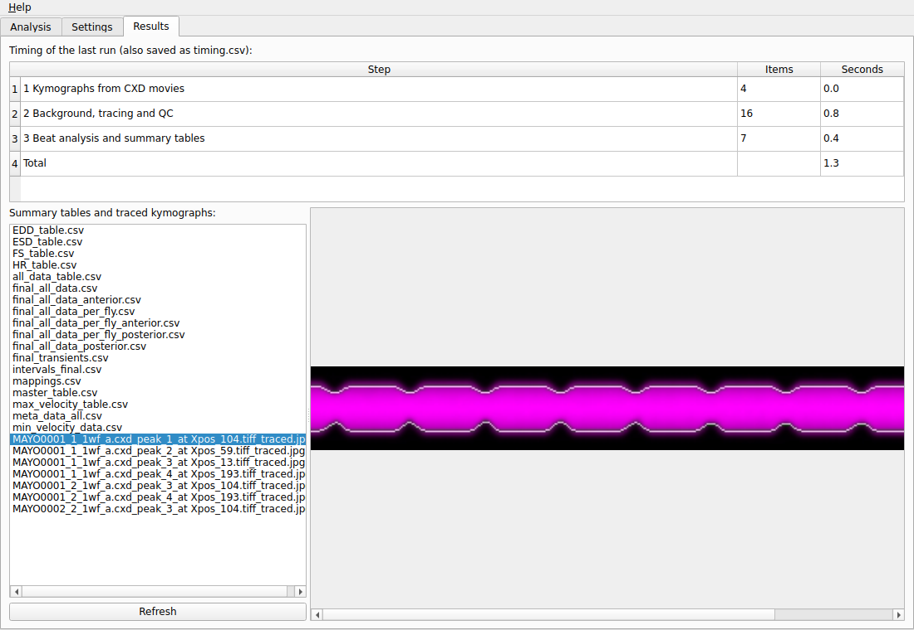

# tdtK Heart Analyzer (standalone)

A standalone desktop app that runs the same analysis as
`tdtK_Full_Analysis_script_v0.7.5.R`, **without R, RStudio, Fiji/ImageJ, Java or bftools**.
It reads movies from most fluorescence microscopes, not only Hamamatsu `.cxd` (see *Movie formats*).
It is a Python port with a graphical interface, and it can be packaged as a double-clickable
app for Windows, macOS and Linux.

> **Status: 1.0.0 alpha.** The port has been validated component by component (see
> *Validation*) and end-to-end on synthetic movies. It has **not yet been compared against
> R results on real `.cxd` recordings**. Please do that before using it for real data (see
> *How to compare with the R script*).



## What it does

The same three stages as the R script, with the same folder layout and output files:

| Step | R script part | What happens |
|---|---|---|
| 1 | Script No.1 | Imports every movie (any supported format, sub-folders included), finds the heart stripes, writes kymograph TIFFs, `…_SD and peaklines.tiff`, `…_new_meta_data.csv` and `…_directionmarks.csv` next to each movie |
| 2 | Fiji macro, Scripts No.2 and No.3 | Copies the kymographs to `<output>/TIFFs`, subtracts the background (ImageJ rolling ball, radius 50), traces the heart edges, writes `.tiff.csv` and `_traced.jpg`, and sorts traces into *excellent*, *good* and *bad traces* (quality control) |
| 3 | Scripts No.4 and No.5 | Finds beats, fits splines, calculates intervals, arrhythmia index, diameters, fractional shortening, velocities and direction, and writes all summary tables into `<output>/balled/excellent traces` |

Files that already exist are not recomputed, as in the R script, so an interrupted run can
simply be started again.

## Movie formats

| Microscope software / format | Extensions | Frame interval | Pixel size | Tested here with |
|---|---|---|---|---|
| Hamamatsu HCImage / SimplePCI | `.cxd` | ✓ | ✓ | generated CXD files |
| OME-TIFF (Bio-Formats, Micro-Manager, ZEN/NIS/LAS exports) | `.ome.tif(f)` | ✓ | ✓ | files written by tifffile |
| ImageJ / Fiji TIFF (hyperstacks) | `.tif`, `.tiff` | ✓ (`finterval`) | ✓ (calibration) | files written by tifffile |
| Micro-Manager TIFF | `.tif` | ✓ | ✓ | – |
| Zeiss LSM | `.lsm` | ✓ | ✓ | – |
| Zeiss ZEN | `.czi` (scenes = separate movies) | if stored | ✓ | files written by pylibCZIrw |
| Nikon NIS-Elements | `.nd2` (XY positions = separate movies) | ✓ | ✓ | – (library only) |
| Leica LAS X | `.lif` (every image = separate movie) | ✓ | ✓ | – (library only) |
| Olympus FluoView | `.oib`, `.oif` | ✓ | ✓ | – (library only) |
| MetaMorph | `.stk` | ✓ | ✓ | – |
| Plain TIFF stacks (e.g. camera software) | `.tif` | enter it | enter it | files written by tifffile |
| AVI (see below) | `.avi` | playback rate - check it | enter it | uncompressed grey/RGB, ImageJ/Fiji 8-bit palette, MJPEG, PNG, FFV1 16-bit, H.264 |
| Other video | `.mp4`, `.mov`, `.mkv` | playback rate - check it | enter it | H.264 files written by PyAV |
| Everything else Bio-Formats reads (`.ims`, `.dv`, `.vsi`, `.ics`, `.oir`, …) | | ✓ | ✓ | only if Bio-Formats' `bftools` (Java) is installed |

"–" means the reader uses the format's standard Python library but has **not been tried on a real
file yet**. Please test one movie per microscope before analysing a whole experiment.

How a recording becomes the movie the analysis needs:

- **Channel:** *auto* picks a channel named like tdTomato/mCherry/RFP/DsRed/561/594…, otherwise
  the first. You can also give an index (`0`, `1`, …) or part of a name.
- **Z planes:** plane 0 by default, or `max` for a maximum projection. Stacks that have no time
  axis but many Z/image planes (for example ImageJ stacks saved as slices) are read as time.
- **Rotation:** the analysis expects the heart to run left to right. Rotate by 90/180/270°, or
  choose *auto*, which detects a vertical heart from where the movement is.
- **Missing metadata:** plain TIFF stacks and videos often have no frame interval or pixel size.
  Enter them for all movies ("… if missing") or per movie in the import table. Movies without
  them are not analysed.
- **Multi-movie files** (`.lif`, `.nd2` positions, `.czi` scenes): each movie gets its own output
  name. If a series is named like the flies (for example `MAYO0001_1_1wf`), that name is used;
  otherwise it is `<file>_<series>`.
- **Output names** keep the movie's extension (`fly.nd2_peak_1_at Xpos_120.tiff`), and the
  `cxd_file` column of the tables holds the movie file name for every format.

### AVI files

- **Supported AVI types:**
  - uncompressed 8-bit grey or RGB, including ImageJ/Fiji's *Save As > AVI* (palette-based grey)
  - MJPEG, PNG, H.264
  - FFV1, 16-bit grey included, read without loss
- **Grey movies saved as colour** are recognised and read as one channel.
- **Frame rate:** an AVI only stores a *playback* frame rate. Fiji's export, for example,
  defaults to 7 fps, which is not the camera frame rate. The app therefore always asks you to
  confirm the frame interval of video files; the usual playback rates (7, 10, 15, 24, 25, 30,
  60 fps …) are flagged explicitly.
- **Pixel size:** AVIs never store one, so it must be entered.
- **Compression:** lossy codecs (MJPEG, H.264, …) are flagged. Prefer uncompressed or TIFF
  exports.

### Metadata checks

The import step checks every movie's metadata and shows where each value came from. The
possible sources are: the file, the per-frame time stamps, an assumption, the file's
modification date, the video playback rate, a default setting, or *entered by you*.

| Check | Level |
|---|---|
| Frame interval or pixel size missing | red: the movie cannot be analysed until you enter it |
| Frame interval from a video playback rate; header interval differing from the frame time stamps | amber |
| Irregular frame timing, or dropped frames (gaps in the time stamps) | amber |
| Implausible values (interval outside 0.05 ms–10 s, pixel size outside 0.02–30 µm, exactly 1 µm "uncalibrated") | amber |
| Assumed calibration (`.cxd` with factor = 1 → 0.65 µm, as in the R script) | amber |
| Recording date unknown or implausible | amber |
| Several channels without names, or no tdTomato-like channel | amber |
| Time taken from a Z/image axis; lossy video | amber |
| Date only from the file's modification time | information |

When the time stamps show dropped frames, the typical (median) interval is used and a warning
is shown, because the analysis assumes evenly spaced frames.

### Correcting metadata

- **In the table:**
  - Red cells are missing values and amber cells are doubtful ones.
  - Values you entered are shown in **bold blue**.
  - The status tooltip lists every problem.
  - Double-click a cell to edit it. Frame intervals accept `5`, `5 ms`, `0.005 s` or `200 fps`;
    pixel sizes accept `0.65`, `0.65 um` or `650 nm`; dates accept `YYYY-MM-DD [HH:MM]`.
- **In the metadata editor** below the table:
  - It shows every value of the selected movie with its source (for example
    *entered by you (file: 142.9 ms)*) and the list of problems.
  - **Apply to all selected** writes the fields you changed to every selected row, for example
    the frame rate and pixel size of all AVIs from one microscope.
  - **Reset to file values** undoes your corrections.
  - **Calculator…** computes the pixel size from camera pixel × binning / magnification.
- **Where corrections go:** they are saved immediately to `movie_import.csv` and survive a
  rescan. Each movie's `…_new_meta_data.csv` records whether its values came from the file or
  were entered.



### The import table

**Import** tab → *Scan movie folder* lists every movie with the format, size, channels, frame
interval, pixel size and a status:

- green: ready
- amber: ready, with a note
- red: something is missing
- grey: skipped (too short, or frame interval above the limit)

You can edit the output name, channel, rotation, frame interval and pixel size, or untick a
movie. *Preview* shows the first frame and the movement map, so you can check the channel and
that the heart runs left to right. The choices are saved as `movie_import.csv` in the output
folder. That file can also be edited in Excel, and step 1 always uses it.



## Using the app

1. Start *tdtK Heart Analyzer* (or `python -m tdtk_analyzer` from this folder).
2. **Movie folder**: the folder with the movies (R: `movie_dir`).
   **Output folder**: R's `target_dir`.
   **Genotype mappings**: `mappings.xlsx` or `mappings.csv`, in the same format as before.
3. Optionally check the movies on the **Import** tab (recommended for formats other than `.cxd`).
4. Tick the steps to run. These replace R's two "reprocess CXD/TIFF files?" questions.
5. Click **Run analysis**. The progress bars, the log and the elapsed time update live.
   **Cancel** stops after the files that are currently being processed.
6. The **Results** tab shows how long each step took, all the summary tables and a preview of
   every traced kymograph. Double-click a file to open it.

The **Settings** tab has the number of parallel workers and the skip rules used by the R script
(at least 200 frames, frame interval of at most 10 ms, and for `.cxd` files a minimum size of
150 MB), plus the rolling-ball radius. The defaults are the R script's values.



### Command line

```bash
# list the movies and write the editable import table (movie_import.csv)
python -m tdtk_analyzer scan --movies /data/movies --output /data/analysis
python -m tdtk_analyzer run --movies /data/movies --output /data/analysis \
       --mappings /data/movies/mappings.xlsx --workers 8
# defaults for movies without metadata / other channels:
python -m tdtk_analyzer run ... --channel mCherry --rotate auto --interval-ms 5 --pixel-um 0.65
# only redo the summary tables:
python -m tdtk_analyzer run --output /data/analysis --mappings mappings.xlsx --steps 3
```

Every run appends to `tdtk_analyzer_log.txt` and writes `timing.csv` into the output folder.

## Installing

**Pre-built app:** download the artifact for your system from the *tdtK Analyzer (Python app)*
GitHub Actions workflow, unzip it and start `tdtK-Heart-Analyzer`. Python is not needed.

**From source** (Python 3.9 or newer; tested with 3.9 to 3.13):

```bash
cd tdtk-analyzer
pip install .            # or: pip install -e ".[dev]" for tests and packaging
tdtk-analyzer-gui        # GUI
tdtk-analyzer run ...    # command line
```

If your system Python is old or you don't want to touch it, use a separate environment with a
newer Python, for example with [uv](https://docs.astral.sh/uv/):

```bash
uv venv -p 3.12 .venv && source .venv/bin/activate    # Windows: .venv\Scripts\activate
uv pip install -e .
tdtk-analyzer-gui
```

Python 3.9 no longer receives security updates from the Python project (end of life October
2025). It still works, but a newer Python is recommended.

**Building the app yourself:** run `pip install -e ".[dev]"`, then
`cd packaging && pyinstaller tdtk-analyzer.spec --noconfirm`. The app is written to
`packaging/dist/`. PyInstaller builds for the system it runs on, so build on Windows to get a
Windows app. The GitHub workflow builds all three systems.

## Speed

- The CXD reader loads a movie as 16-bit integers (R used 8-byte doubles), so a movie needs
  about a quarter of the memory it needed in R.
- A 157 MB synthetic movie (512×128 px, 1200 frames) goes through step 1 in about 2 s.
- Tracing, quality control and beat analysis run in parallel across all CPU cores.
- Movies are processed one at a time by default, because each is held in memory. Increase
  *Movies processed at the same time* only if you have enough RAM.

## Output files

The same names and columns as the R script, including the column order of `final_all_data.csv`,
`final_all_data_per_fly*.csv`, `all_data_table.csv`, `master_table.csv`, `EDD/ESD/FS/HR_table.csv`,
`min_velocity_data.csv`, `max_velocity_table.csv`, `meta_data_all.csv` and `Quality_control.csv`.

The R script also saved intermediate `.Rdata` files. Instead, the app writes:

| R | App |
|---|---|
| `intervals_final.Rdata` | `intervals_final.csv` |
| `final_transients.Rdata` | `final_transients.csv` |
| `transients_final.Rdata` | `transients_final.csv.gz` |
| `metrics_all_splined.Rdata`, `spline_all.Rdata`, `z.Rdata`, other `.Rdata` | not written (their content is in the tables above) |

## How the R dependencies were replaced

| R / external tool | Replacement | Validation |
|---|---|---|
| bftools `showinf`, RBioFormats `read.image` (CXD) | `cxd.py`: reads the OLE2 file directly, following Bio-Formats' `PCIReader` (frame order, padded rows, timestamps, calibration) | Round-trip test with generated CXD files |
| (other microscope formats) | `movies/`: one reader per format (tifffile, nd2, readlif, pylibCZIrw, oiffile, PyAV), optional Bio-Formats fallback | Tests with OME-TIFF, ImageJ, plain TIFF, CZI and MP4 files, and a full analysis on a folder of mixed formats |
| Fiji macro `Subtract Background… rolling=50` | `background.py`: port of ImageJ's `BackgroundSubtracter` (3×3 smoothing, shrink ×4, ball, bilinear enlarge) | Equal to a line-by-line port of ImageJ's Java loops (tests) |
| `stats::smooth.spline` (GCV) | `rstats.SmoothSpline`: R's knot rule, R's penalty matrix (including sgram's `.3330` constant) and R's Brent search for `spar` | Matches real R: `spar` to 1e-8, predictions to about 1e-12 (tests, reference data in `tests/data`) |
| `baseline::rollingBall(wm=20, ws=20)` | line-by-line port | Matches real R to 1e-15 |
| `EBImage::gblur`, `writeImage`, zoo, pracma, `lm`, `quantile`, `mad`, … | NumPy/SciPy equivalents with R's definitions | Unit tests against values produced by R |

## Differences from the R script

- **Problem files are skipped, not fatal.** A file that would have stopped the whole R run with
  an error (for example no calibration in the CXD file, no complete beats, edges that cannot be
  traced, or a missing direction file) is skipped and reported in the log instead.
- The loops that adapt the peak-window size are capped at 1000 rounds. In R the second loop
  could run forever when the window size reached 0.
- Genotype groups are sorted case-insensitively, which approximates R's locale sorting. This
  only affects the row order.
- **R quirks that are kept on purpose, so the numbers stay comparable:**
  - The direction speed uses `Xpos2 - Xpos1 * resolution`, R's operator precedence.
  - The magnification-2 calibration "fix" has no effect.
  - `final_all_data_per_fly_anterior/posterior.csv` contain `anterograde_speed.x/.y`, where the
    main table has `stocks`.

## How to compare with the R script

1. Copy a few `.cxd` movies into two separate folders.
2. Run R v0.7.5 on one copy and this app on the other, with the same `mappings` file.
3. Compare `Quality_control.csv` (were the same traces classified the same way?), then
   `final_all_data.csv` and `master_table.csv`.

Small differences in the last digits are expected: TIFF/JPEG encoding, and float32 against
float64 in the background subtraction. Please report anything larger.

## Code overview

```
tdtk_analyzer/
  movies/        import: one reader per format, scanning, import table, rotation/channel
  cxd.py         CXD file parser (no Java)
  kymograph.py   step 1
  background.py  ImageJ rolling-ball background subtraction
  tracing.py     step 2 (tracing + quality control)
  transients.py  step 3, per kymograph (beats, splines, metrics)
  aggregate.py   step 3, summary tables
  rstats.py      R-compatible numerics (smooth.spline, rollingBall, quantile, lm, ...)
  rio.py         R-style CSV/TIFF/JPEG writing, R-style file naming helpers
  pipeline.py    runs the steps: parallel workers, progress, cancel, log, timing
  gui.py, gui_import.py / cli.py
tests/           pytest suite (synthetic CXD writer, R reference values)
packaging/       PyInstaller spec
```
